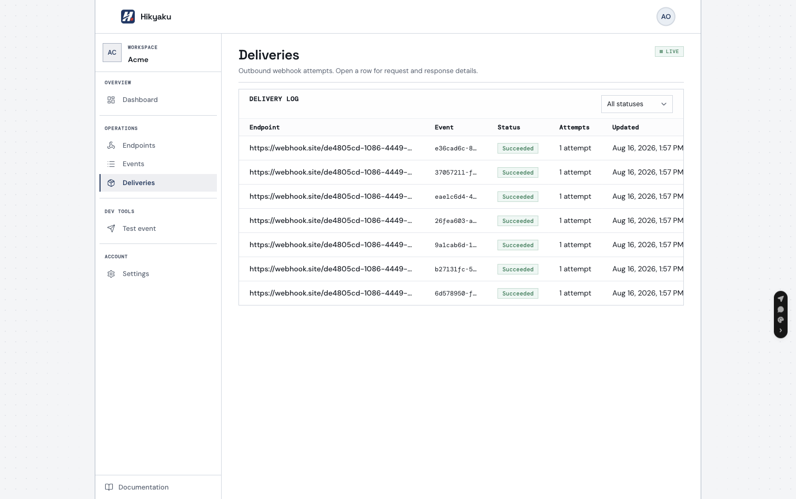
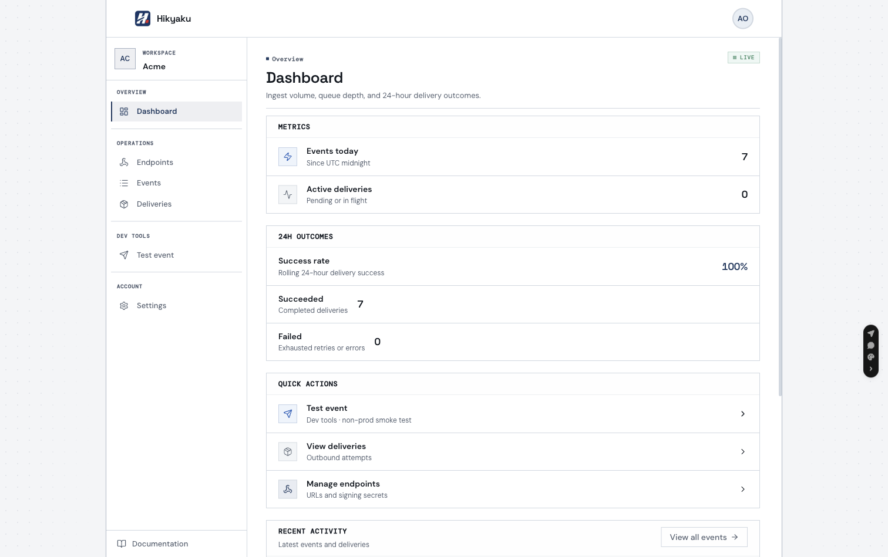

# Hikyaku

<p align="center">
  
</p>

Self-hosted, multi-tenant webhook delivery. Ingest an event once; the API fans it out to one delivery per active endpoint, and the worker signs each HTTP POST with HMAC-SHA256, delivers it with at-least-once semantics, retries transient failures with exponential backoff, and keeps attempt history in an operator console. A recovery sweeper re-enqueues deliveries stuck after a crash, and exhausted deliveries can be replayed from the console or API.

**Name:** 飛脚 (_hikyaku_) — Japan’s historic express couriers.

**Stack:** Node.js, Express, BullMQ, Postgres, Redis, Vite/React.

**Repo:** [github.com/0x4Nayan04/Hikyaku](https://github.com/0x4Nayan04/Hikyaku) · **License:** [MIT](./LICENSE)

**Product docs (after `pnpm dev`):** http://localhost:5173/docs

## Demo

No hosted demo yet — run it locally (below). After `pnpm dev`:

| Surface | URL                         |
| ------- | --------------------------- |
| Landing | http://localhost:5173       |
| Docs    | http://localhost:5173/docs  |
| Console | http://localhost:5173/login |

Bootstrap once at `/bootstrap`, invite a tenant owner from **Admin**, then use the tenant console.

## Architecture

```
Producer ──POST /v1/events──► API ──fan-out + enqueue deliveries──► Redis (BullMQ)
                                                │
                                                ▼
                                    Worker (sign + deliver)
                                                │
                         ┌──────────────────────┼──────────────────────┐
                         ▼                      ▼                      ▼
                   Endpoint A             Endpoint B             Endpoint C
                (HMAC-SHA256 POST)     (retry / backoff)      (attempt logs)
                                                │
                                                ▼
                                         Postgres + console
                                    (events, deliveries, polling)
```

| Piece         | Role                                         |
| ------------- | -------------------------------------------- |
| `apps/api`    | Auth, ingest, endpoints, deliveries, admin   |
| `apps/worker` | Signed outbound HTTP, retries, rate limits, recovery sweeper |
| `apps/web`    | Landing, docs, operator console              |
| Postgres      | Tenants, events, deliveries, attempt history |
| Redis         | BullMQ delivery queue                        |

Each delivery is claimed with a database lease before its HTTP attempt, so a crashed worker is recoverable: a sweeper resets deliveries stuck in `in_progress` and re-enqueues them. Queue jobs are deduplicated per delivery, so fan-out and replay never double-schedule. Subscribers should verify `X-Webhook-Signature` and reject timestamps older than 5 minutes — see [docs → Signing](http://localhost:5173/docs#signing).

## Screenshots





## Prerequisites

- Node.js 20 (`nvm use`)
- [pnpm](https://pnpm.io/)
- Docker (Postgres 16 + Redis 7 for local development)

## Local development

```bash
git clone https://github.com/0x4Nayan04/Hikyaku.git
cd Hikyaku
cp .env.example .env
pnpm install
pnpm docker:up
pnpm db:migrate
pnpm dev
```

| Service     | URL                                  |
| ----------- | ------------------------------------ |
| API         | http://localhost:3000                |
| Web console | http://localhost:5173                |
| Docs        | http://localhost:5173/docs           |
| Worker      | background process (BullMQ consumer) |

```bash
pnpm --filter @webhook/api dev
pnpm --filter @webhook/worker dev
pnpm --filter @webhook/web dev
```

## First-time setup

### Option A — Bootstrap (local UI)

1. Open http://localhost:5173/bootstrap
2. Enter `ADMIN_BOOTSTRAP_SECRET` from `.env`
3. Create the super-admin → sign in at `/login`
4. On **Admin**, invite a tenant owner and send them the one-time link
5. Sign in as that tenant → **Dashboard** (`/dashboard`)

### Option B — Dev seed (API smoke tests)

```bash
pnpm db:seed
```

Seed prints login emails/passwords and one API key per tenant (local/dev only). Sign in at `/login`, or use the printed key for ingest. You can also create keys under **Settings → API keys**.

| Tenant | Email              | Password                    |
| ------ | ------------------ | --------------------------- |
| Acme   | `acme@localhost`   | `dev-password-min-12-chars` |
| Globex | `globex@localhost` | `dev-password-min-12-chars` |

Optional super-admin seed (only when no users exist):

```bash
# In .env:
# SEED_SUPER_ADMIN_EMAIL=admin@localhost
# SEED_SUPER_ADMIN_PASSWORD=dev-password-min-12-chars
```

## Console overview

| Page          | Route                | Who                    |
| ------------- | -------------------- | ---------------------- |
| Landing       | `/`                  | Public                 |
| Docs          | `/docs`              | Public                 |
| Login         | `/login`             | Public                 |
| Bootstrap     | `/bootstrap`         | First deploy only      |
| Accept invite | `/accept-invite`     | Invite recipients      |
| Dashboard     | `/dashboard`         | Tenant users           |
| Endpoints     | `/endpoints`         | Tenant users           |
| Events        | `/events`            | Tenant users           |
| Send event    | `/events/send`       | Tenant users           |
| Deliveries    | `/deliveries`        | Tenant users (polling, replay) |
| Settings      | `/settings`          | Tenant users                   |
| Admin         | `/admin`             | Super-admin only       |
| Tenant admin  | `/admin/tenants/:id` | Super-admin only       |

**Roles:** Super-admins invite tenant owners and manage tenants and users. Tenant users manage endpoints, events, deliveries, and API keys. Super-admins are not tenant-scoped and cannot open tenant dashboard pages.

API usage, signing, retries, and the full route table live in the in-app docs: http://localhost:5173/docs

## Delivery guarantees

- **At-least-once** — a delivery retries until 2xx, a permanent failure, or the attempt cap. `X-Webhook-Id` is the delivery UUID and stays constant across retries; use it to dedupe on the subscriber side.
- **Lease + sweeper** — each HTTP attempt is claimed with a DB lease; a background sweeper resets deliveries stuck in `in_progress` and re-enqueues them.
- **Idempotent enqueue** — BullMQ jobs are deduplicated per delivery, so fan-out and replay never double-schedule.
- **Rate limited** — 100 outbound attempts per minute per tenant (see `RATE_LIMIT_PER_MINUTE`); exceeding it pauses a delivery for ~60s without counting toward the 5-attempt cap.
- **Retry policy** — exponential backoff (1m → 2m → 4m → 8m) for network errors, timeouts, 408, 429, and 5xx; other 4xx fail fast.
- **Replay** — only `failed` deliveries can be re-queued (`POST /v1/deliveries/:id/replay` or the delivery detail page); attempt history is cleared on replay.
- **Timestamped + signed** — every POST carries `X-Webhook-Timestamp`; receivers should require `|now − timestamp| ≤ 300s`.

## Health checks

```bash
curl http://localhost:3000/v1/health
curl http://localhost:3000/v1/ready
```

`/v1/health` — API process up. `/v1/ready` — Postgres and Redis reachable.

## Manual smoke test (webhook.site)

Needs API, worker, and a tenant API key (printed by `pnpm db:seed`, or create one under Settings).

1. Open [webhook.site](https://webhook.site) and copy the URL.
2. Create an endpoint with that URL. Save the `secret`.
3. Ingest an event (see [docs → Quick start](http://localhost:5173/docs#quick-start)).
4. On webhook.site, confirm body `{ id, type, created_at, data }` and signature headers.
5. Verify HMAC as in [docs → Signing](http://localhost:5173/docs#signing).

## Environment variables

| Variable                 | Purpose                                    |
| ------------------------ | ------------------------------------------ |
| `DATABASE_URL`           | Postgres                                   |
| `DB_POOL_MAX`            | Max PostgreSQL connections per process     |
| `REDIS_URL`              | Redis / BullMQ                             |
| `ADMIN_BOOTSTRAP_SECRET` | One-time super-admin bootstrap             |
| `SESSION_SECRET`         | Session cookie signing (min 32 chars)      |
| `SESSION_COOKIE_MAX_AGE` | Session cookie lifetime (ms)               |
| `WEB_APP_URL`            | Invite link base URL                       |
| `INVITE_TTL_MS`          | Invite link expiry (default 7 days)        |
| `CORS_ORIGIN`            | Allowed browser origins                    |
| `TRUST_PROXY`            | Proxy hops for `X-Forwarded-*` (default 0) |
| `INGEST_RATE_LIMIT_PER_MINUTE` | Max `POST /v1/events` calls per tenant/minute |
| `AUTH_RATE_LIMIT_PER_MINUTE`   | Max login attempts per IP/minute               |
| `LOG_LEVEL`                    | Log verbosity                                  |
| `VITE_API_URL`                 | API base URL for the web app (build-time)      |

See `.env.example` for worker tuning (`DELIVERY_TIMEOUT_MS`, `MAX_DELIVERY_ATTEMPTS`, `RATE_LIMIT_PER_MINUTE`, `WORKER_CONCURRENCY`, etc.).

## Scripts

| Command                 | Description                                 |
| ----------------------- | ------------------------------------------- |
| `pnpm dev`              | Start API, worker, and web concurrently     |
| `pnpm build`            | Build all packages                          |
| `pnpm typecheck`        | TypeScript check (api, worker, web, shared) |
| `pnpm lint`             | ESLint                                      |
| `pnpm format`           | Prettier                                    |
| `pnpm test`             | Unit + integration tests                    |
| `pnpm test:integration` | API and worker integration tests            |
| `pnpm test:smoke`       | Playwright smoke / visual tests             |
| `pnpm test:smoke:ui`    | Playwright UI mode                          |
| `pnpm start:api`        | Apply migrations, then run the API          |
| `pnpm start:worker`     | Run the delivery worker                     |
| `pnpm start:web`        | Serve the built web app                     |
| `pnpm docker:up`        | Start Postgres and Redis                    |
| `pnpm docker:down`      | Stop Docker services                        |
| `pnpm db:migrate`       | Apply database migrations                   |
| `pnpm db:seed`          | Seed demo tenants, users, and API keys      |
| `pnpm db:generate`      | Generate Drizzle migrations                 |

## Project layout

```
apps/api         REST API (Express) — auth, ingest, deliveries, admin
apps/worker      Delivery worker (BullMQ)
apps/web         Operator console + docs (Vite + React)
packages/shared  Shared types, schema, env parsing, crypto
e2e/             Playwright smoke and visual tests
```
