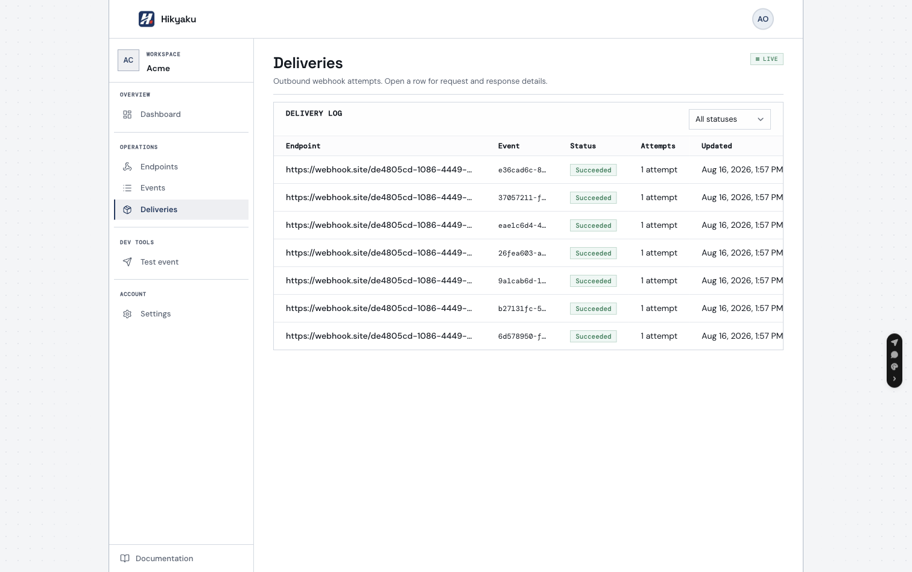
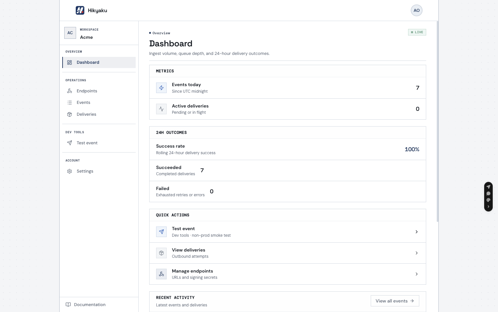

# Hikyaku

<p align="center">
  
</p>

Self-hosted, multi-tenant webhook delivery. Ingest an event once; the API fans it out to one delivery per active endpoint, and the worker signs each HTTP POST with HMAC-SHA256, delivers it with at-least-once semantics, retries transient failures with exponential backoff, and keeps attempt history in an operator console. A recovery sweeper re-enqueues deliveries stuck after a crash, and exhausted deliveries can be replayed from the console or API.

**Name:** 飛脚 (_hikyaku_) — Japan’s historic express couriers.

**Stack:** Node.js, Express, BullMQ, Postgres, Redis, Vite/React.

**Live:** [hikyaku.nayanswarnkar.com](https://hikyaku.nayanswarnkar.com) · **Docs:** [hikyaku.nayanswarnkar.com/docs](https://hikyaku.nayanswarnkar.com/docs) · **Repo:** [github.com/0x4Nayan04/Hikyaku](https://github.com/0x4Nayan04/Hikyaku) · **License:** [MIT](./LICENSE)

## What is included

- **Idempotent ingest and fan-out** — accept an event once, create only missing deliveries for active endpoints, and reject reuse of an idempotency key with a different payload.
- **Durable delivery** — a transactional outbox covers the Postgres-to-Redis handoff; database leases, application-owned retries, and a recovery sweeper handle interrupted work.
- **Operator console** — dashboard metrics, endpoint and API-key management, event and delivery filters, attempt timelines, and replay with history preserved across runs.
- **Multi-tenant administration** — tenant-isolated data, invite-only accounts, tenant and user management, and admin-issued one-time password-reset links.
- **Secret lifecycle** — API keys can be created, revoked, or rotated; endpoint signing secrets can be rotated in place. Full secrets are shown only when created or rotated.
- **Two production layouts** — a single-host Docker Compose stack with Caddy, or a Vercel web app backed by an API and worker on Railway.

## Live deployment

| Surface | Hosted                                  | Local after `pnpm dev`      |
| ------- | --------------------------------------- | --------------------------- |
| Landing | https://hikyaku.nayanswarnkar.com       | http://localhost:5173       |
| Docs    | https://hikyaku.nayanswarnkar.com/docs  | http://localhost:5173/docs  |
| Console | https://hikyaku.nayanswarnkar.com/login | http://localhost:5173/login |
| API     | https://hikyakuapi.nayanswarnkar.com/v1 | http://localhost:3000/v1    |

The hosted landing page and docs are public. Console access is invite-only; there is no self-serve signup. For your own installation, bootstrap the first super-admin and workspace once at `/bootstrap`, then use **Admin** to invite users and manage tenants.

## Architecture

```
Producer ──POST /v1/events──► API ──transaction──► Postgres
                              │                   (event + deliveries + outbox)
                              │                              │
                              └──── immediate enqueue ───────┼────► Redis (BullMQ)
                                                             │            │
Worker sweeper ──reads pending outbox─────────────────────────┘            ▼
                                                                        Worker
                                                                          │
                                         HMAC-SHA256 POST + retries ───────┼────► Endpoints
                                                                          │
                                  Postgres ◄──── attempts + final state ───┘

Console ──polls API──► Postgres
```

| Piece         | Role                                                         |
| ------------- | ------------------------------------------------------------ |
| `apps/api`    | Auth, ingest, endpoints, deliveries, admin                   |
| `apps/worker` | Signed outbound HTTP, retries, rate limits, recovery sweeper |
| `apps/web`    | Landing, docs, operator console                              |
| Postgres      | Tenants, events, deliveries, attempt history                 |
| Redis         | BullMQ delivery queue                                        |

Each delivery is claimed with a database lease, and its attempt number is reserved before the HTTP call, so a crashed worker is recoverable without granting an extra attempt: a sweeper resets deliveries stuck in `in_progress` and re-enqueues them. Queue jobs are deduplicated per delivery for the current live queue job, so fan-out and replay do not double-schedule that job — HTTP delivery remains at-least-once. Subscribers should verify `X-Webhook-Signature` and reject timestamps older than 5 minutes — see [docs → Signing](https://hikyaku.nayanswarnkar.com/docs#signing).

## Screenshots





## Prerequisites

- Node.js 20 for local app development (`nvm use` / `.nvmrc`). The one-time production config command in `deploy/` needs Node.js 22+.
- [pnpm](https://pnpm.io/)
- Docker (Postgres 16 + Redis 7 for local development)

## Local development

```bash
git clone https://github.com/0x4Nayan04/Hikyaku.git
cd Hikyaku
cp .env.example .env
pnpm install
pnpm docker:up
pnpm --filter @webhook/shared build
pnpm db:migrate
pnpm dev
```

| Service     | URL                                  |
| ----------- | ------------------------------------ |
| API         | http://localhost:3000                |
| Web console | http://localhost:5173                |
| Docs        | http://localhost:5173/docs           |
| Worker      | background process (BullMQ consumer) |

```bash
# Run each in its own terminal after the setup commands above.
pnpm --filter @webhook/api dev
pnpm --filter @webhook/worker dev
pnpm --filter @webhook/web dev
```

Both `pnpm dev` and the individual `dev` commands build the shared package before starting. The explicit build above also makes `pnpm db:migrate` work on a fresh checkout.

## First-time setup

### Option A — Bootstrap (local UI)

1. Open http://localhost:5173/bootstrap
2. Enter `ADMIN_BOOTSTRAP_SECRET` from `.env`
3. Create your installer account and first workspace → sign in at `/login`
4. On **Dashboard**, add an endpoint, send a sample event, and inspect delivery
5. Use **Admin** separately if you need to invite other users or manage tenants

### Option B — Dev seed (API smoke tests)

```bash
pnpm db:seed
```

Seed prints login emails/passwords and one API key per tenant (local/dev only). It exits before writing when `NODE_ENV=production`. Sign in at `/login`, or use the printed key for ingest. You can also create keys under **Settings → API keys**.

| Tenant | Email                | Password                    |
| ------ | -------------------- | --------------------------- |
| Acme   | `acme@example.com`   | `dev-password-min-12-chars` |
| Globex | `globex@example.com` | `dev-password-min-12-chars` |

Optional super-admin seed (creates that email if unused):

```bash
# In .env:
SEED_SUPER_ADMIN_EMAIL=admin@example.com
SEED_SUPER_ADMIN_PASSWORD=dev-password-min-12-chars
```

Then `pnpm db:seed` and sign in as that email for **Admin**.

## Console overview

| Page            | Route                | Who                            |
| --------------- | -------------------- | ------------------------------ |
| Landing         | `/`                  | Public                         |
| Docs            | `/docs`              | Public                         |
| Why Hikyaku     | `/why-haiku`         | Public                         |
| Login           | `/login`             | Public                         |
| Bootstrap       | `/bootstrap`         | First deploy only              |
| Accept invite   | `/accept-invite`     | Invite recipients              |
| Reset password  | `/reset-password`    | Reset-link recipients          |
| Dashboard       | `/dashboard`         | Tenant users                   |
| Endpoints       | `/endpoints`         | Tenant users                   |
| Events          | `/events`            | Tenant users                   |
| Event detail    | `/events/:id`        | Tenant users                   |
| Send event      | `/events/send`       | Tenant users                   |
| Deliveries      | `/deliveries`        | Tenant users (polling, replay) |
| Delivery detail | `/deliveries/:id`    | Tenant users                   |
| Settings        | `/settings`          | Tenant users                   |
| Admin           | `/admin`             | Super-admin only               |
| Tenant admin    | `/admin/tenants/:id` | Super-admin only               |

**Roles:** Super-admins invite tenant owners; search, rename, or delete tenants; invite or remove tenant users; and issue one-time password-reset links. Tenant users manage endpoints, events, deliveries, and API keys. API keys and endpoint signing secrets can be rotated from the console. Super-admins with an assigned workspace can use that workspace’s console pages; Admin remains a separate area.

API usage, signing, retries, filters, replay behavior, and the full route table live in the [product docs](https://hikyaku.nayanswarnkar.com/docs).

## Delivery guarantees

- **At-least-once** — a delivery retries until 2xx, a permanent failure, or the attempt cap. `X-Webhook-Id` is the delivery UUID and stays constant across retries; use it to dedupe on the subscriber side.
- **Transactional outbox** — fan-out inserts each delivery and an outbox row in the same Postgres transaction; the worker drains the outbox before sweeping stale leases, so a committed delivery is not lost if Redis is unavailable at ingest.
- **Lease + sweeper** — each HTTP attempt is reserved in the database before the request; a crash still consumes that slot. A background sweeper resets deliveries stuck in `in_progress` after the worker lease expires and re-enqueues them without clearing the attempt count. It waits for `next_retry_at` before sending a deferred retry.
- **Idempotent enqueue** — BullMQ jobs are deduplicated per delivery for the current live queue job, so fan-out and replay do not double-schedule that job (HTTP delivery is still at-least-once).
- **Rate limited** — 100 outbound admissions per minute per tenant (see `RATE_LIMIT_PER_MINUTE`); exceeding it defers the delivery until the next UTC minute plus jitter, without counting toward the 5-attempt cap. The pause appears in worker logs; the delivery row is not marked `rate_limited`.
- **Retry policy** — exponential backoff (1m → 2m → 4m → 8m) for network errors, timeouts, 408, 429, and 5xx; other 4xx fail fast.
- **Replay** — `failed` deliveries start a new run (`POST /v1/deliveries/:id/replay` or the delivery detail page), which increments `replay_count` and keeps prior attempts under earlier `run_number` values. A `pending` replay returns `202` without resetting that run. An `in_progress` replay returns `400`; the sweeper recovers it. Disabled endpoints and succeeded deliveries are rejected.
- **Timestamped + signed** — every POST carries `X-Webhook-Timestamp`; receivers should require `|now − timestamp| ≤ 300s`.

## Security boundaries

- Tenant scope comes from the authenticated session or API key, never from a tenant id supplied in the request body.
- API keys and invite/reset tokens are stored as SHA-256 hashes. Endpoint signing secrets remain recoverable server-side because the worker needs them to sign requests.
- Production endpoint validation requires HTTPS and blocks loopback, private, link-local, metadata, CGNAT, and documentation address ranges. The worker resolves and pins DNS addresses for the request and validates every redirect again.
- Production session writes require an allowed `Origin`; cookies are `httpOnly`, `Secure`, and `SameSite=None`. Login is limited by client IP and normalized email.
- Stored subscriber response bodies are truncated to about 1 KiB. Hikyaku does not add application-level encryption at rest beyond the configured database and filesystem.
- Invite and password-reset links are returned to the super-admin for manual delivery; the application does not send email.

## Health checks

```bash
curl http://localhost:3000/v1/health
curl http://localhost:3000/v1/ready
```

`/v1/health` — API process up. `/v1/ready` — Postgres and Redis reachable.

## Manual smoke test (webhook.site)

Needs API, worker, and a tenant API key (printed by `pnpm db:seed`, or create one under Settings).

1. Open [webhook.site](https://webhook.site) and copy the URL.
2. Create an endpoint with that URL. Save the `secret`.
3. Ingest an event (see [docs → Quick start](https://hikyaku.nayanswarnkar.com/docs#quick-start)).
4. On webhook.site, confirm body `{ id, type, created_at, data }` and signature headers.
5. Verify HMAC as in [docs → Signing](https://hikyaku.nayanswarnkar.com/docs#signing).

## Environment variables

| Variable                       | Purpose                                                                                                                                         |
| ------------------------------ | ----------------------------------------------------------------------------------------------------------------------------------------------- |
| `DATABASE_URL`                 | Postgres                                                                                                                                        |
| `DB_POOL_MAX`                  | Max PostgreSQL connections per process                                                                                                          |
| `REDIS_URL`                    | Redis / BullMQ                                                                                                                                  |
| `ADMIN_BOOTSTRAP_SECRET`       | One-time super-admin bootstrap                                                                                                                  |
| `SESSION_SECRET`               | Session cookie signing (min 32 chars)                                                                                                           |
| `SESSION_COOKIE_MAX_AGE`       | Session cookie lifetime (ms)                                                                                                                    |
| `WEB_APP_URL`                  | Invite link base URL                                                                                                                            |
| `INVITE_TTL_MS`                | Invite link expiry (default 7 days)                                                                                                             |
| `CORS_ORIGIN`                  | Allowed browser origins                                                                                                                         |
| `TRUST_PROXY`                  | Proxy hops for `X-Forwarded-*`. Local development defaults to `0`. Production requires an explicit value and refuses startup when it is absent. |
| `INGEST_RATE_LIMIT_PER_MINUTE` | Max `POST /v1/events` per tenant/minute (Bearer also uses the same limit per client IP before the key lookup)                                   |
| `AUTH_RATE_LIMIT_PER_MINUTE`   | Auth attempts per IP/minute; login also limits normalized email                                                                                 |
| `DELIVERY_TIMEOUT_MS`          | Outbound request timeout and basis for the worker lease                                                                                         |
| `MAX_DELIVERY_ATTEMPTS`        | HTTP attempt cap for each delivery run                                                                                                          |
| `RATE_LIMIT_PER_MINUTE`        | Outbound delivery admissions per tenant/minute                                                                                                  |
| `WORKER_CONCURRENCY`           | Concurrent BullMQ jobs handled by a worker                                                                                                      |
| `SWEEP_INTERVAL_MS`            | Interval for draining the outbox and reclaiming stale deliveries                                                                                |
| `LOG_LEVEL`                    | Log verbosity                                                                                                                                   |
| `VITE_API_URL`                 | API base URL for the web app (build-time). Empty or unset in the Vercel production build so the browser calls same-origin `/v1`.                |
| `VITE_PUBLIC_API_URL`          | Public API origin baked into docs and curl samples (the Railway URL). Unset locally; the samples then use `VITE_API_URL`.                       |
| `API_UPSTREAM_URL`             | Railway API origin used by the Vercel `/v1` proxy                                                                                               |
| `PROXY_IP_SECRET`              | Shared secret so the Vercel `/v1` proxy can pass the browser IP. Set the same value on Vercel. Omit on the single-host Compose stack.           |

See `.env.example` for local worker tuning and [production tuning](deploy/README.md#tuning) for variables Compose passes through, their defaults, and how to apply changes.

`TRUST_PROXY=1` means one trusted reverse-proxy hop, and the value must match the deployment. Use `0` only when the API itself terminates TLS.

Login is throttled by both client IP and normalized email. Password-reset submissions share the same per-IP auth window, so exhausting that window can temporarily block a reset submission.

## Scripts

| Command                 | Description                                 |
| ----------------------- | ------------------------------------------- |
| `pnpm dev`              | Start API, worker, and web concurrently     |
| `pnpm build`            | Build all packages                          |
| `pnpm typecheck`        | TypeScript check (api, worker, web, shared) |
| `pnpm lint`             | ESLint                                      |
| `pnpm format`           | Prettier                                    |
| `pnpm test`             | Unit + integration tests                    |
| `pnpm test:unit`        | Unit tests across the workspace             |
| `pnpm test:integration` | API and worker integration tests            |
| `pnpm test:smoke`       | Playwright smoke / visual tests             |
| `pnpm test:smoke:ui`    | Playwright UI mode                          |
| `pnpm start:api`        | Apply migrations, then run the API          |
| `pnpm start:worker`     | Run the delivery worker                     |
| `pnpm start:web`        | Serve the built web app                     |
| `pnpm docker:up`        | Start Postgres and Redis                    |
| `pnpm docker:down`      | Stop Docker services                        |
| `pnpm db:migrate`       | Apply database migrations                   |
| `pnpm db:migrate:prod`  | Run the built API migration script          |
| `pnpm db:seed`          | Seed demo tenants, users, and API keys      |
| `pnpm db:generate`      | Generate Drizzle migrations                 |

## Project layout

```
apps/api         REST API (Express) — auth, ingest, deliveries, admin
apps/worker      Delivery worker (BullMQ)
apps/web         Operator console + docs (Vite + React)
packages/shared  Shared types, schema, env parsing, crypto
api/proxy.ts     Same-origin Vercel proxy for /v1
deploy/          Production setup, Caddy config, and operations guide
e2e/             Playwright smoke and visual tests
```

## Production deployment

See [deployment instructions](deploy/README.md) for both supported layouts:

- **Single host:** API, worker, Postgres, Redis, and Caddy in Docker Compose, with only Caddy publishing ports. Start with `node deploy/setup.mjs`.
- **Split host:** static web app and same-origin `/v1` proxy on Vercel; API and worker on Railway. The proxy forwards browser cookies and, when configured with `PROXY_IP_SECRET`, the verified client IP used by rate limits.

The existing `pnpm dev` workflow is unchanged.

## Safe tests

Use `.env.test.example` as a reference for explicit `TEST_DATABASE_URL`, `TEST_REDIS_URL`, and a fresh `TEST_RUN_ID`. Tests never load the development `.env`. Provision a separate PostgreSQL database ending in `_test` (and a role limited to it) and a separate Redis service with a nonzero database number. Full disposable-container automation is intentionally deferred.

Export these test variables plus the test secrets shown in the example, with development `DATABASE_URL`/`REDIS_URL` unset. Build shared code first, then migrate only the test database:

```sh
pnpm --filter @webhook/shared build
DATABASE_URL="$TEST_DATABASE_URL" pnpm db:migrate
pnpm test
pnpm test:smoke
```

Browser tests start their own API on 3101 and web server on 5181, with no reuse of development servers. They never truncate databases. Use an empty test database for fresh-bootstrap tests; for repeated browser runs supply `SMOKE_SUPER_EMAIL`/`SMOKE_SUPER_PASSWORD` for that test installation. Test cleanup removes only run-owned fixtures and jobs. CI follows the same connection rules.
